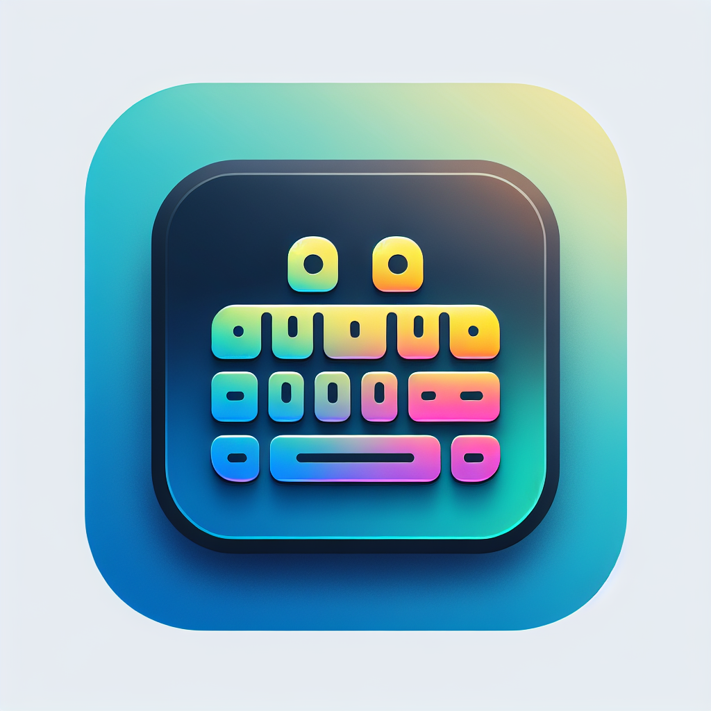
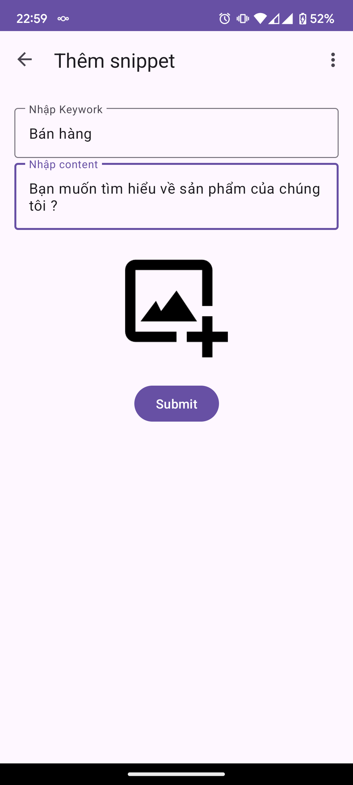
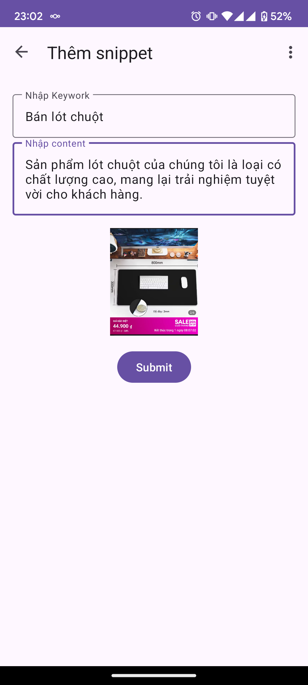
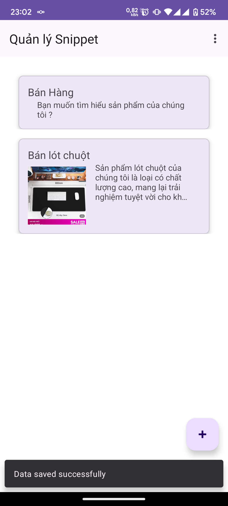
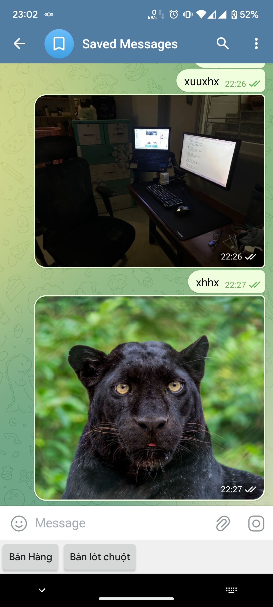

# SellerKeyboard

A keyboard have template for seller can easy to use in chat with customer using clipboard and
images (if editor support).

  

## Features

- [x] Support clipboard
- [x] Support images
- [x] Manage snippets
- [x] Keyboard view
- [x] Support multiple chat apps
- [x] Support multiple languages

## Screenshots

  
  
  
  

## Work on:

- [x] Messenger
- [x] Zalo
- [x] Telegram

## Not work on:

- [ ] Facebook
- [ ] Shopee
- [ ] Lazada

References:

- [Keyboard Design](https://www.figma.com/design/kw9CGigo5HLvBg9EERw9cC/Android-Keyboard-%E2%80%93%C2%A0Material-3-UI-Kit-(Community)?node-id=14-10749&node-type=FRAME&t=SSti3FEp9NBVNxpe-0)
- [Create an input method](https://developer.android.com/develop/ui/views/touch-and-input/creating-input-method)
- [Image keyboard support](https://developer.android.com/develop/ui/views/touch-and-input/image-keyboard)
- [Google Voice Typing integration](https://github.com/johnjamesmiller/google-voice-typing-integration)
- [Compose Keyboard IME](https://github.com/THEAccess/compose-keyboard-ime)
- [KeyboardApp](https://github.com/IBRUTALI/KeyboardApp)
- https://github.com/THEAccess/compose-keyboard-ime/tree/main